:tocdepth: 1

.. sectnum::

.. Metadata such as the title, authors, and description are set in metadata.yaml

.. TODO: Delete the note below before merging new content to the main branch.

.. note::

   **This technote is a work-in-progress.**

Abstract
========

There are several different ways to interface with the hardware that controls the Auxiliary Telescope dome.  This technote describes how these are done.

Introduction
================
The control for the dome for the Auxiliary Telescope was managed by Astronomical Consultants and Equipment, Inc. of Tucson.  Their detailed report on the operation of the dome is in downloadable Appendix 1.  The purpose of this technote is to give a briefer summary of how to interface with the dome components, with references to the more complete document where appropriate.

Control boxes.
===================================
There are three main control boxes, as seen below:

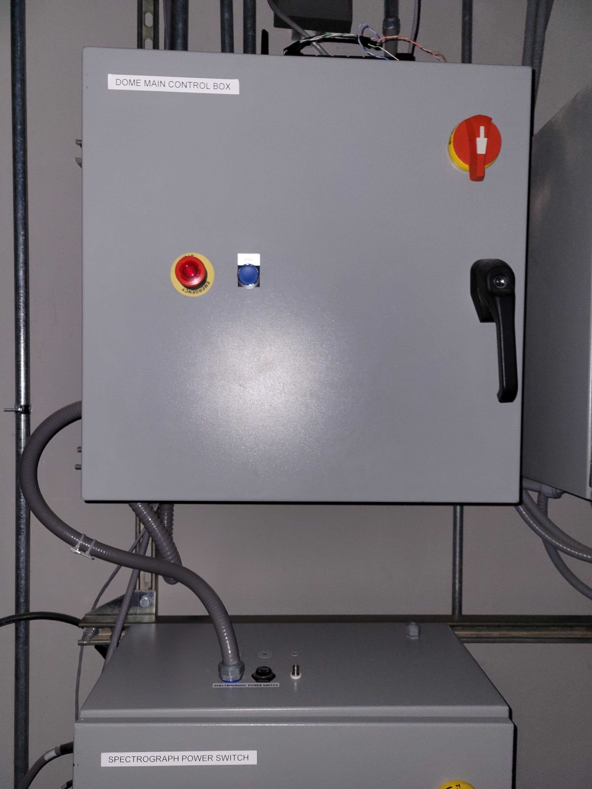

Figure 1.  Main control box. This is on the first floor near the ventilation fan.

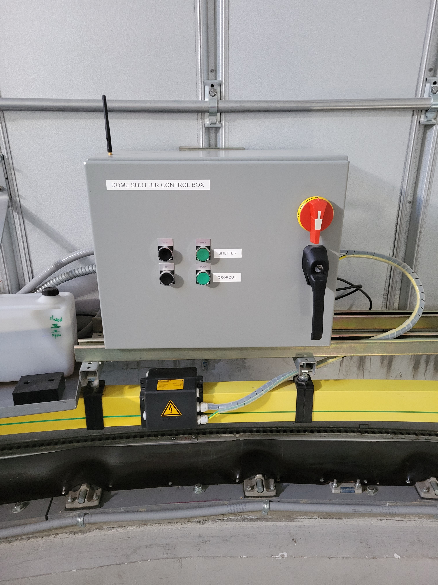

Figure 2.  Top control box.  Note that this box rotates with the dome.  Therefore it gets power through the yellow power wiper, and communicates with WiFi.

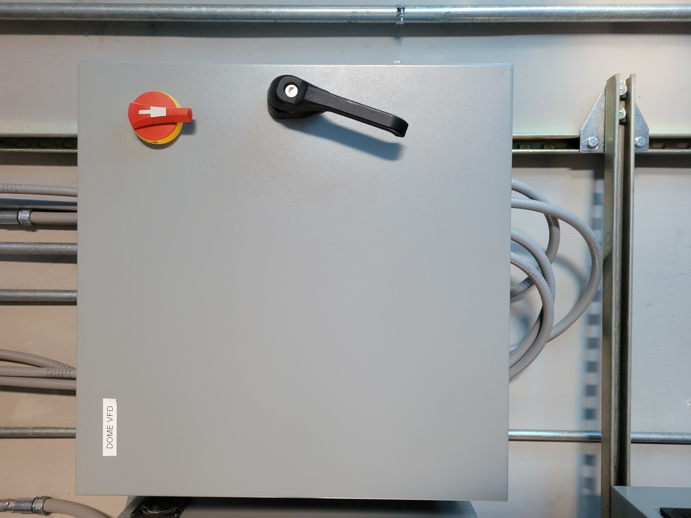

Figure 3.  VFD control box.  This is on the first floor near the ventilation fan.  This has the Variable Frequency Drive (VFD) that drives the motors that rotate the dome.

Remote control with telnet.
==============================
For low level control of the dome, you can use the telnet interface.  This allows you to rotate the dome, open the slit, etc. Follow these steps:

#. telnet auxtel-dome-crio-main.cp.lsst.org 17310
#. At the > prompt, type HELP.

This will give you a list of commands.  More details are in Figure 3.2 of downloadable Appendix 1.

Connecting to the control box EUIs
==================================
The main control box and top control box each have Engineering User Interfaces (EUIs) that allow you to view the state of each control interface.  In general these allow you to see the states, but not actually do a significant amount of control.  You can access these screens as follows:

#. Open Microsoft Remote Desktop
#. Go to aux-brick01.cp.lsst.org. Figure 4 shows the physical location of this computer.
#.  The username and password are in the 1password vault.
#. Open Microsoft Edge, and you should see tabs for the Main Box Dome Control and Top Box Dome Control.

   Figures 5 and 6 show what these screens should look like.

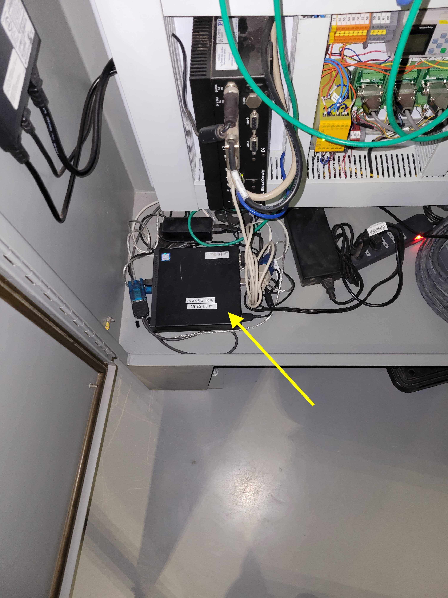

Figure 4.  The aux-brick01.cp.lsst.org computer is on the floor of the main control cabinet on the first floor of the AuxTel dome.

   
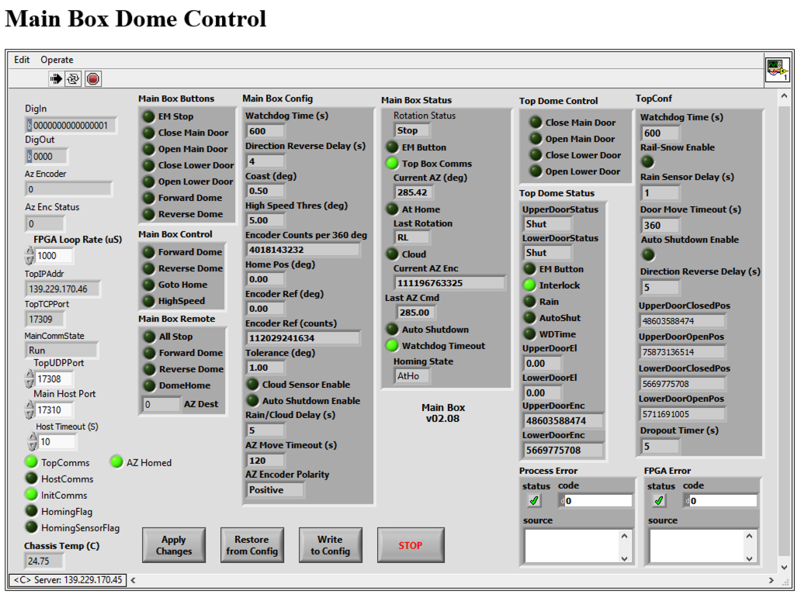

Figure 5.  Main Box Control

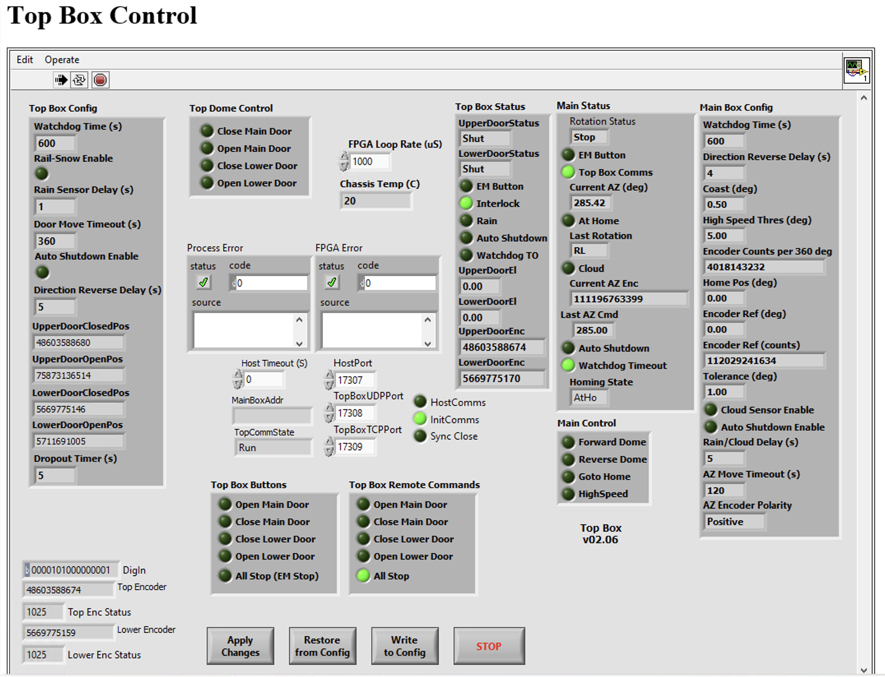

Figure 6.  Top Box Control

Working with the variable frequency drive
==================================================
The Schneider VFD controller is show in Figure 7.  Changes to the VFD programming can adjust the dome rotation speed, accelerations, etc.  Instructions on how to do this are in dowloadable Appendix 1, Sections 2.4 and 2.5, and in downloadable Appendix 3.

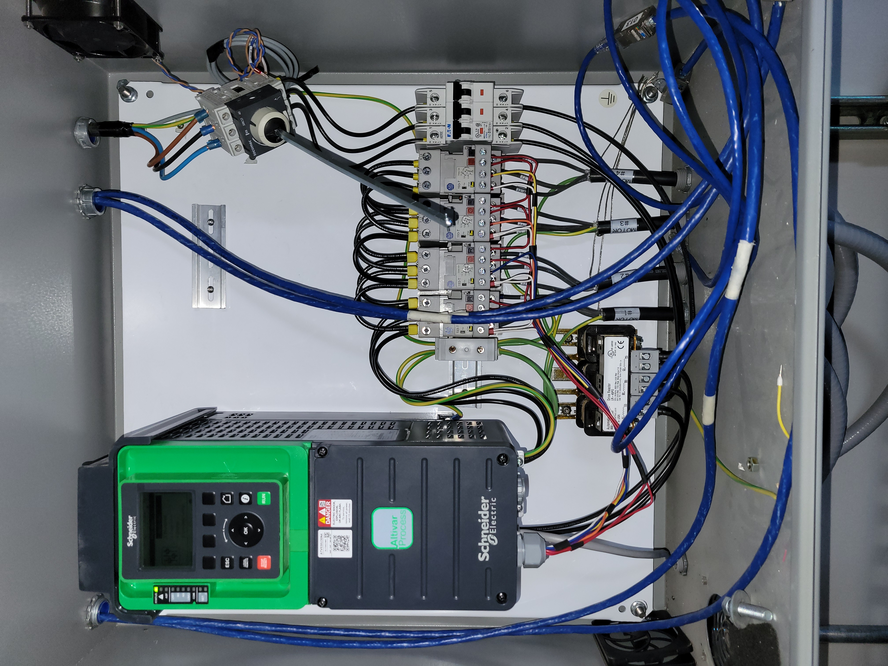

Figure 7.  VFD controller

Problem 1 - Lack of button control
============================================
There are a number of problems with the AuxTel dome currently.  The first one is detailed in https://jira.lsstcorp.org/browse/OBS-257.  Basically, after the ATDome cRIO is re-booted, the manual dome rotation buttons respond as they should. However, once the ATDome CSC is enabled, the rotation buttons fail to respond, even after the CSC is back in standby.   Note that both the main shutter and the dropout shutter open/close buttons continue to respond as they should, it is only the dome rotation buttons that are affected.  To reboot the cRIOs and recover this functionality, Figures 9 and 10 show the locations of the cRIO reset buttons.  The main box cRIO should be reset first, followed by the top box cRIO.

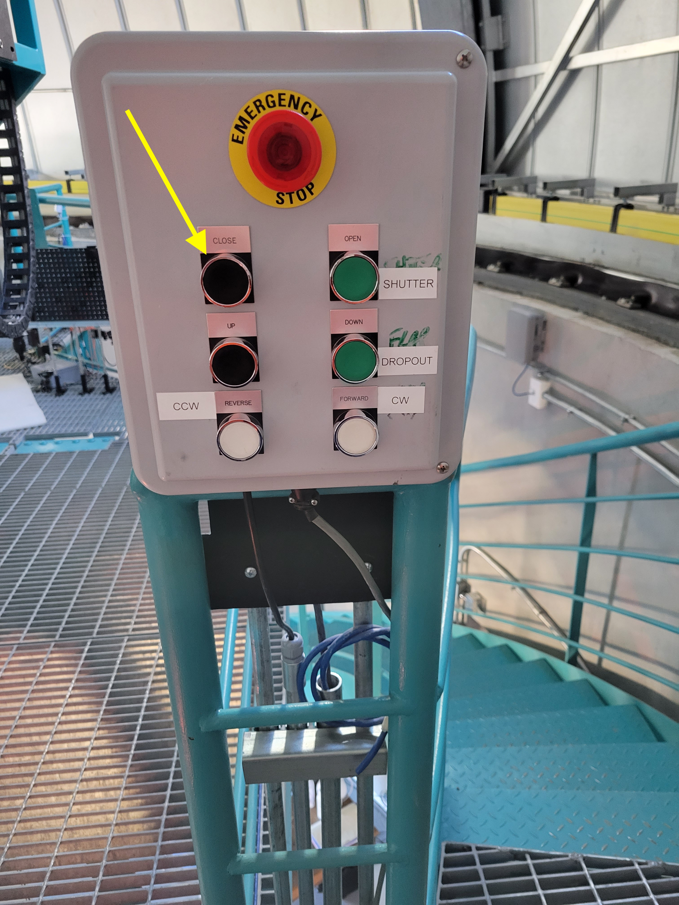

Figure 8.  This box at the top of the stairs has manual buttons for controlling the dome.

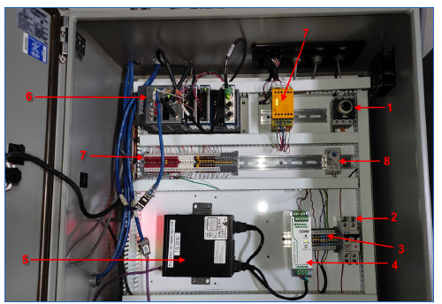

Figure 9.  Arrow 6 shows the location of the reset button for the main box cRIO.

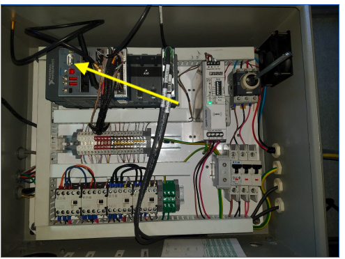

Figure 10.  The yellow arrow shows the location of the reset button for the top box cRIO.

Problem 2 - Phantom dome closures.
=====================================
A second problem we have been fighting is called "phantom dome closures".  These are described in https://jira.lsstcorp.org/browse/OBS-89.  A brief summary of the problem is as follows:

Problem: Between 0 to ~30 times per night, the main shutter of the AuxTel dome closes slightly.

What we know:

#.  We know the shutter is actually closing slightly and it is not a software glitch. We can see the motor relay being energized, and we can see the shutter encoder changing.

#.  About 2/3 of the events show up as state changes in the EFD, but about 1/3 are not captured in the EFD.

#.  About 1/3 of the time, the lower (dropout) door opens slightly at the same time as the main shutter closes slightly.

#.  The events are brief, typically lasting 100-150 ms.

#.  The signal to close appears to come from the top box (the one that rotates with the dome). The close signal shows up there first, and only later shows up in the main box (the one downstairs)

We have eliminated the following causes:

#.  There are no close commands in the EFD, so the command to close is not coming from the CSC.

#.  None of the manual buttons light up, so they are not the source. We also have independent monitoring of one of the close buttons and it never moves.

#.  It is not the rain sensor. This is disabled in the software and the light does not come on.

#.  It is not the cloud sensor. This is disabled in the software and the light does not come on.

#.  It is not a loss of communication between the main box and the top box. I tried cutting that communication and the shutter did not close. Also, the light indicating successful communication between the two boxes stays on during the events.

#.  It is not a problem with power supplied to the top box cRIO.  We have attached a monitor to the 24V supply feeding this cRIO, and it is very stable.

Fritz Mueller and I have installed a LabJack to monitor the signals in the top box.  There is a second LabJack ready to be connected to the main box, but it is not yet hooked up.  This has enabled us to verify what is actually happening and has led to the learning in the summary above.  To enable the monitoring involves running a Python script which is available at: https://github.com/craiglagegit/Notebook_Keeper/blob/main/scripts/Dome_Monitor_Test_17Aug23.py

To launch this, I typically use the following command:

nohup python Dome_Monitor_Test_17Aug23.py --end_time 2023-10-12T10:00:00 >& monitor_log_11oct23.txt&

This will start the monitoring, and it will finish at the end_time.  The monitor_log file contains a log to verify that the monitoring ran successfully.

After running the monitoring, I typically analyze the data with this notebook:

https://github.com/craiglagegit/Notebook_Keeper/blob/main/summit_notebooks/Dome_Monitor_Analysis_24Aug23.ipynb

This will make a series of plots like Figure 11.

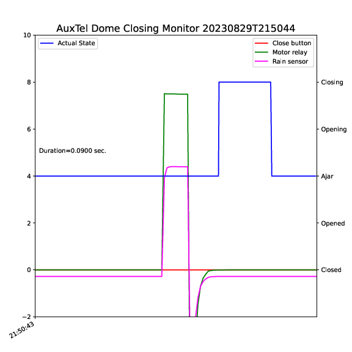

Figure 11.  A plot of a typical phantom close event from the dome monitoring set-up.

Downloadable Appendices
===============================
These downloadable appendices are included with this technote and have additional details.

Appendix 1: LSST_AT_SmartDome_v22-05-24.pdf  :download:`pdf <_static/LSST_AT_SmartDome_v22-05-24.pdf>`

Appendix 2: LSST_AT_SmartDome_Electrical_Drawings_V22_05_24.pdf  :download:`pdf <_static/LSST_AT_SmartDome_Electrical_Drawings_V22_05_24.pdf>`

Appendix 3: ATV900_Programming_Manual_EN_NHA80757_09.pdf  :download:`pdf <_static/ATV900_Programming_Manual_EN_NHA80757_09.pdf>`

