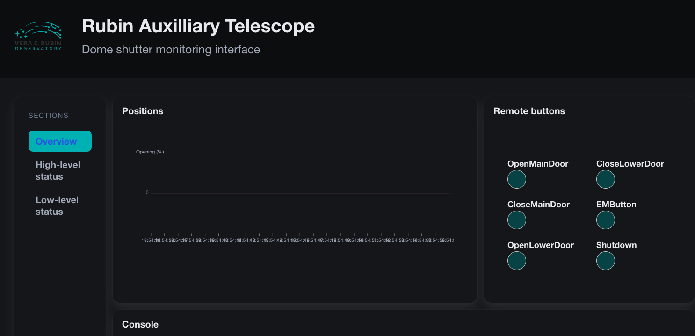

#######################################################
Interfacing with the Auxiliary Telescope dome hardware.
#######################################################

.. abstract::

   There are several different ways to interface with the hardware that controls the Auxiliary Telescope dome.  This technote describes how these are done.

.. Metadata such as the title, authors, and description are set in metadata.yaml

.. TODO: Delete the note below before merging new content to the main branch.

Introduction
================
The control for the dome for the Auxiliary Telescope was managed by Astronomical Consultants and Equipment, Inc. of Tucson.  Their detailed report on the operation of the dome is in downloadable Appendix 1.  In 2024 and 2025, the cRIOs that control the dome were extenisvely reprogrammed by a team from NOIRLab.  This team consists of Manuel Gomez, Patricio Cortes, Braulio Cancino, and Norman Diaz.  The purpose of this technote is to give a brief summary of how to interface with the dome components, with references to the more complete document where appropriate.

Control boxes.
===================================
There are four main control boxes, as seen below:

Figure 1.  Main control box. This is on the first floor near the ventilation fan.

.. image:: ./_static/Top_Box.jpg

Figure 2.  Top control box.  Note that this box rotates with the dome.  Therefore it gets power through the yellow power wiper, and communicates with WiFi.  In the near future, this box aill be replaced with a larger box to accomodate more hardware.

Figure 3.  VFD control box.  This is on the first floor near the ventilation fan.  This has the Variable Frequency Drive (VFD) that drives the motors that rotate the dome.

.. image:: ./_static/Box_at_Top_of_Stairs.jpg

Figure 4.  This box at the top of the stairs has manual buttons for controlling the dome.

High-level architecture
==============================
In normal operation, the dome is controlled by the ATDome CSC.  Commands from ATDome are sent to the Main Box using the telnet interface (see next section).  The Main Box controls the dome rotation.  For control of the dome shutters, the Main Box sends commands to the Top Box over WiFi.  This means the Top Box never communicates with the ATDome CSC directly.  The manual buttons on the Top Box, seen in Figure 2 are for controlling the dome shutters.  Pressing these buttons sends commands directly to the Top Box cRIO, so the Main Box is not involved.  The manual control buttons on the box at the top of the stairs (see Figure 4), can control dome rotation as well as opening and closing the dome shutters.  Note that when the dome shutter buttons on this box are pressed, the command is sent to the Main Box, which then sends a command to operate the shutters to the Top Box.

Remote control with telnet.
==============================
For low level control of the dome, you can use the telnet interfaces.  This allows you to rotate the dome, open the shutters, etc. It is possible to telnet into the Main Box and send commands over telnet.  These are the same commands that are sent by ATDome to the Main Box.  To connect to the Main Box, follow these steps:

#. telnet auxtel-dome-mainbox.cp.lsst.org 17310  
#. At the > prompt, type HELP.

This will give you the following list of commands::

  Firmware Version 3.0
  ?  Short Status
  +  Full Status
  ST  Stop all motion
  CL  Close Main Door
  OP  Open Main Door
  UP  Close (rise) Dropout Door
  DN  Open (lower) Dropout Door
  SO  Synchronized Open (Both doors open together)
  SC  Synchronized Close (Both doors close together)
  AO  Auto shutdown ON
  AF  Auto shutdown OFF
  CO  Cloud Sensor ON
  CF  Cloud Sensor OFF
  CN  Rotate to encoder center position
  HM  Rotate to home position
  d MV  Move to Azimuth (d=degrees,0.0<=d<360)
  d TOL  Tolerance (d=degrees,0.0<=d<3)
  d HZ  Define home position (d=degrees,0.0<=d<360)
  d HS  High speed threshold (d=degrees,0.0<=d<10)
  d LM  Encoder counts for 360 degrees
  t WT  Watchdog Timer (t=seconds,600 typical)
  t RD  Set reverse direction motion delay (t=seconds,0<=t<6)
  t AT  Set Azimuth motion timeout (t=seconds,120<=t<600)
  t RS  Set Rain / Cloud activate delay (t=seconds,1<=t<10)
  AEP  AZ Encoder Count Positive
  AEN  AZ Encoder Count Negative
  CFS  Save current configuration
  CFR  Recall last saved configuration
  AWO  Private control link ON (WIFI-6 antenna)
  AWF  Private control link OFF (WIFI-6 antenna)
  HELP  Display this list of available commands

 It is also possible to telnet into the Top Box  To connect to the Top Box, follow these steps.  Note that the IP address of the Top Box may change.

#. telnet 139.229.170.101 17307
#. At the > prompt, type HELP.

This will give you the following list of commands::

  ?       :       System status short-report
  +       :       System status full-report
  AO      :       Auto shutdown ON
  AF      :       Auto shutdown OFF
  AWO     :       Private control link ON (WIFI-6 anntena)
  AWF     :       Private control link OFF (WIFI-6 anntena)
  CF      :       Clear system fault alerts
  CL      :       Close Main Door
  DN      :       Open (lower) Dropout Door
  EXIT    :       Disconnect and close telnet session
  HELP    :       Telnet commands description
  HT      :       Telnet session timeout (t=seconds, 0 < t < 3600)
  MF      :       Maintenance Mode OFF
  MO      :       Maintenance Mode ON
  OVE     :       Enable  Override (d=number, 0<=d<=25)
  OVD     :       Disable Override (d=number, 0<=d<=25)
  OV?     :       Override Status
  OP      :       Open Main Door
  RD      :       Set reverse direction motion delay (t=seconds,0<=t<6)
  RF      :       Rain OFF
  RO      :       Rain ON
  RS      :       Set Rain shutdown delay (t=seconds,1<=t<10)
  SC      :       Synchronized Close (Both doors close together)
  SD      :       Simulation mode disable
  SE      :       Simulation mode enable
  SO      :       Synchronized Open (Both doors open together)
  ST      :       Stop both upper & lower dome doors
  SY      :       Synchronize door encoders
  UP      :       Close (rise) Dropout Door
  V       :       Firmware Version
  WT      :       Dome central control (DCC) watchdog time in seconds (600 default)

Connecting to the control box EUIs
==================================
The main control box and top control box each have Engineering User Interfaces (EUIs) that allow you to view the state of each control interface.  In general these allow you to see the states, but not actually do a significant amount of control.  You can access these screens as follows:

#. With a web browser open http://139.229.170.190
#. The physical location of this computer is shown in Figure 5.  Note that the IP may change in the near future.
#.  The username and password are in the 1password vault.  (NOT YET!!!)
#.  Figures 6, 7, and 8 show the EUI screens

Figure 5.  The ATDome EUI computer is on the table on the first floor of the AuxTel dome. NEED NEW PICTURE
   

Figure 6.  EUI computer high level screen

Figure 7.  Top Box EUI

Figure 8.  Main Box EUI

Restarting the cRIOs
============================================

Occasionally there are problems that require restarting the ATDome cRIOs.  This section shows how that is done.  To reboot the cRIOs and recover this functionality, Figures 9 and 10 show the locations of the cRIO reset buttons.  The main box cRIO should be reset first, followed by the top box cRIO.

.. image:: ./_static/Main_Box_cRIO.png

Figure 9.  Arrow 6 shows the location of the reset button for the main box cRIO. NEED NEW PICTURE

Figure 10.  The yellow arrow shows the location of the reset button for the top box cRIO.  NEED NEW PICTURE

Working with the variable frequency drive
==================================================
The Schneider VFD controller is show in Figure 9.  Changes to the VFD programming can adjust the dome rotation speed, accelerations, etc.  Instructions on how to do this are in dowloadable Appendix 1, Sections 2.4 and 2.5, and in downloadable Appendix 3.

.. image:: ./_static/Dome_VFD.jpg

Figure 11.  VFD controller

Downloadable Appendices
===============================
These downloadable appendices are included with this technote and have additional details.

Appendix 1: LSST_AT_SmartDome_v22-05-24.pdf  :download:`pdf <_static/LSST_AT_SmartDome_v22-05-24.pdf>`

Appendix 2: LSST_AT_SmartDome_Electrical_Drawings_V22_05_24.pdf  :download:`pdf <_static/LSST_AT_SmartDome_Electrical_Drawings_V22_05_24.pdf>`

Appendix 3: ATV900_Programming_Manual_EN_NHA80757_09.pdf  :download:`pdf <_static/ATV900_Programming_Manual_EN_NHA80757_09.pdf>`

